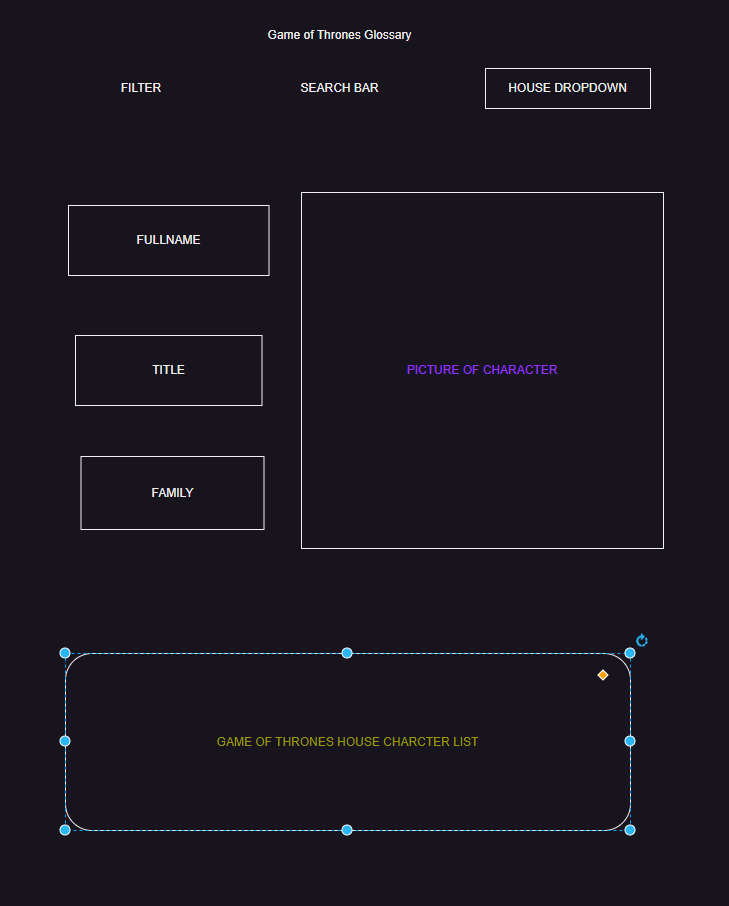

<!-- loremipsum.io

(Figma.com for wire framing or mocking)

--style guides

--user story example

--seed data / example data 
    *atleast 3 example entries
    *include data type

--kanban board: trello (via atlassian) -->


```javascript
Game of Thrones Glossary
```

```javascript
Deliverables
```
* User is able to filter Game of Thrones characters to display on page.
* User is able to search specific character and have character information displayed on page.
* User is able to filter by "house" name and have list of house members returned




<figure>
    

{
"id": 32,
"firstName": "Gendry",
"lastName": "Baratheon",
"fullName": "Gendry Baratheon",
"title": "Lord of Storm's End",
"family": "Baratheon",
"image": "gendry.jpg",
"imageUrl": "https://thronesapi.com/assets/images/gendry.jpg"
}

https://thronesapi.com/
https://github.com/shevabam/game-of-thrones-quotes-api